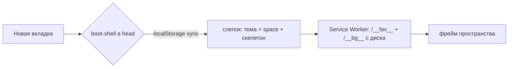

<div align="center">


# Focus — новая вкладка, спроектированная на красоту и скорость

*Три независимых пространства вместо бесконечной ленты. Всё локально. Ноль телеметрии.*


</div>

---

## ☁️ Облачка — визуальная доска

> Кидай, пиши, рисуй. Всё остаётся в браузере.

- 🖼️ **Картинки** из буфера (`Ctrl+V`) и drag-and-drop
- 📝 **Короткие заметки** — прямо на сетке
- ✏️ **Рисование карандашом** с отменой / очисткой
- 💾 Всё хранится **локально** в IndexedDB

<p align="center">
  
</p>

---

## 🎯 Фокус — остров из любимых сайтов

> Только самое важное. Открывается мгновенно, работает без сети.

- 🔖 До **16 сайтов**
- 💾 Фавиконки подтягиваются **один раз** (DuckDuckGo `ip3`) и дальше берутся **с диска**
- 📴 Полный **офлайн** после первого добавления
- 🔍 Свой поисковик + своя видимость поиска

<p align="center">
  
</p>

---

## 🚀 Фокус+ — сетка до 72 сайтов

> Вся коллекция под рукой. С названиями.

- 🗂️ Сетка до **72 сайтов** с названиями
- 📁 Папки — *обсуждается, нужно ли?*
- ⚡ Тот же дисковый кеш иконок, тот же мгновенный старт

<p align="center">
  
</p>

---

## ⚡ Почему быстро

- 🧱 **Никаких фреймворков** — чистый Vanilla JS, ноль сетевых запросов при открытии
- 💿 **Фоны, иконки и картинки из дискового кеша** через service worker — сеть дёргается один раз при добавлении:
  - `favicons → Cache Storage (focus-fav-v1)`
  - `фоны → Cache Storage (focus-bg-v1, /__bg__/<space>)`
  - `BAKE_ICON` прогревает кеш заранее, открытия вкладок — только диск
- 🖼️ **Первый кадр рисуется синхронно** — последнее пространство, тема и скелетоны без ожидания хранилищ (`boot-shell.js` в `<head>`)



---

## 🌙 Почему спокойно

- 🎨 **Две темы из коробки** — сиреневая и тёмная
- ✨ **Уникальные стили иконок через `sites-db.js`** — чтобы иконки всегда были красивыми и узнаваемыми:

```js
// sites-db.js — только исключения, остальное по стандарту
var SITES_DB = {
  'twitch.tv':  { bg: '#FFFFFF', icon: 38, fit: 'long', name: 'Twitch' },
  'github.com': { bg: '#FFFFFF', icon: 38, fit: 'long', name: 'GitHub' },
  'kick.com':   { bg: '#000000', icon: 42 },
};
```

- 🔍 **Свой поисковик и видимость поиска** — отдельно для каждого пространства
- 🔒 **Ноль телеметрии** — данные не покидают браузер, аккаунт не нужен

---

## 🚀 Установка

<details>
<summary><b>Вариант 1 — распакованным расширением (сейчас)</b></summary>

```bash
1. Скачайте / склонируйте репозиторий
2. Откройте chrome://extensions
3. Включите «Режим разработчика»
4. «Загрузить распакованное расширение» → выберите папку Focus/
5. Откройте новую вкладку ✨
```

</details>

<details>
<summary><b>Вариант 2 — из Chrome Web Store (скоро)</b></summary>

> Пока не залито в стор. 

</details>

---

<div align="center">

**Focus — ужасное внимание к деталям лишь для того, чтобы их не замечать**


</div>
